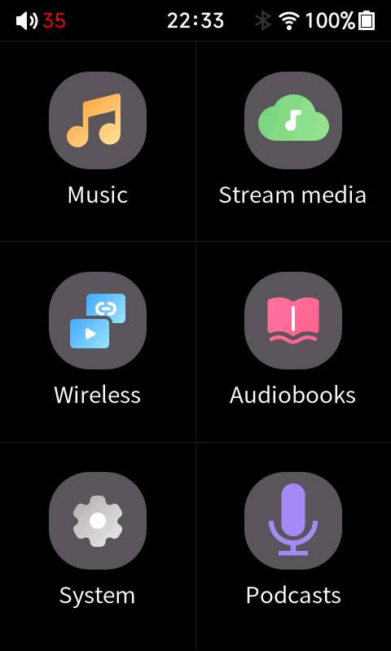
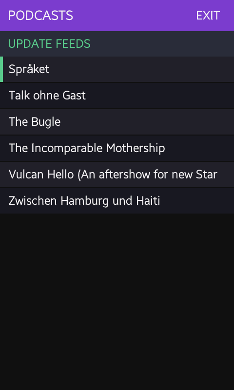
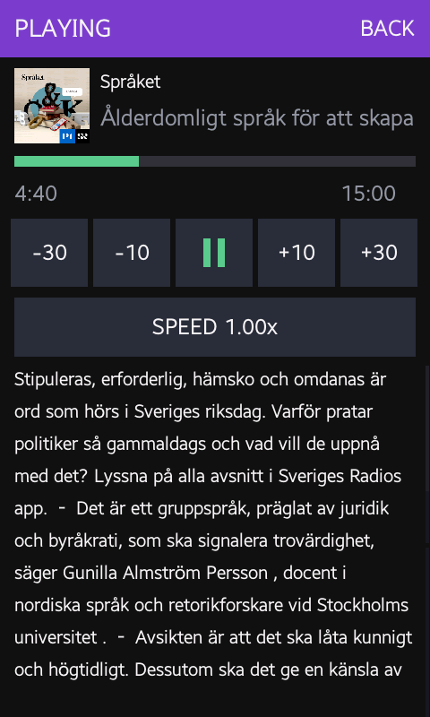
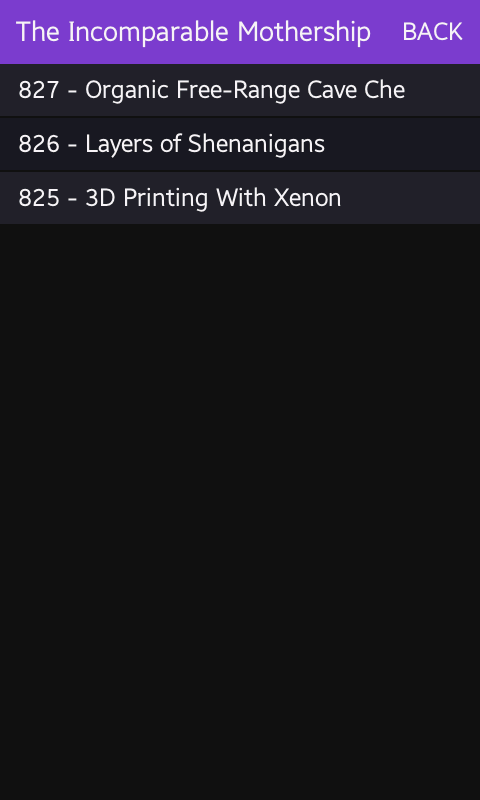
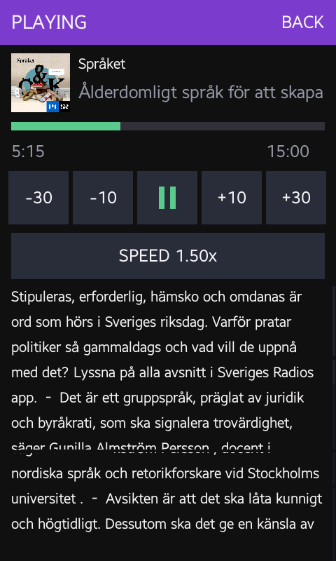
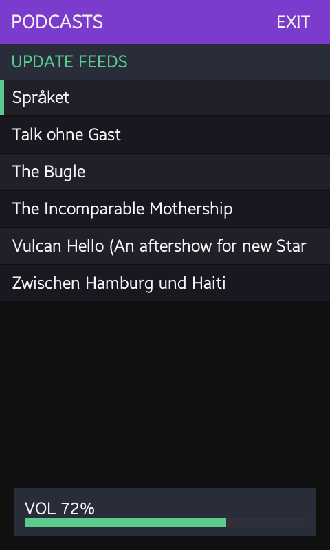
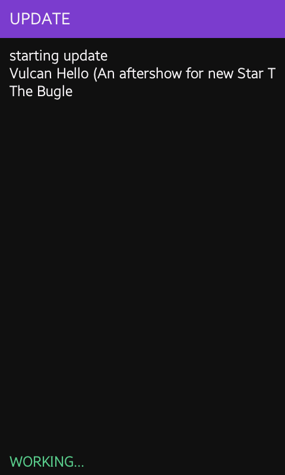

# Podcasts for the HiBy R1

A podcast client that runs **inside** the R1's own music player, on the launcher
tile where **About** used to be.

The R1 is a £70 MIPS DAP with 56 MB of usable RAM, a read-only squashfs rootfs
and no app model whatsoever. This adds one by `LD_PRELOAD`ing a shared object
into `hiby_player` and re-pointing a launcher tile's callback at it. Nothing is
patched on disk; the stock binary is untouched.

<p align="center">
  
  
  
</p>

## What it does

- **Subscriptions** in a plain text file on the SD card, one RSS URL per line.
- **Updates on demand** — tap `UPDATE FEEDS`. No daemon, nothing scheduled.
  The fetcher's log streams to the screen as it runs.
- **Plays MP3** with real transport: `-30 / -10 / play-pause / +10 / +30`.
- **Speed 1.0–2.0×** with pitch preserved (WSOLA time-stretching).
- **Resume positions** persist per episode, across reboots.
- **Show notes**, scrollable, pulled from the feed.
- **Cover art** per feed.
- **Volume** on the hardware keys, wired or Bluetooth.
- **Screen lock** with the power key while audio keeps playing.
- Full Latin text — accents, umlauts, the lot — rendered with a TrueType font
  already on the device.

<p align="center">
  
  
  
  
</p>

## Requirements

- A HiBy R1 running
  [yetisoldier's Audiobook Mod](https://github.com/yetisoldier/Hiby-R1-Audiobook-Mod)
  (developed against **2.0.25**). That mod provides the `LD_PRELOAD` supervisor
  in `/usr/bin/hiby_player.sh` that this app hooks into.
- An SD card.
- ADB over USB for installation.

> The tile addresses are specific to the `hiby_player` binary they were read
> out of. On a different firmware build they will point somewhere else, and the
> app declines to arm itself rather than guess — see
> [Porting](#porting-to-another-firmware-build).

## Install

Build (or take `libpodcast_hook.so` from a release), then:

```bash
adb push libpodcast_hook.so /usr/data/libpodcast_hook.so && adb shell chmod 755 /usr/data/libpodcast_hook.so
```

```bash
adb shell mkdir -p /usr/data/podcast_res && adb push icon/out/about.png icon/out/about_s.png /usr/data/podcast_res/
```

The fetcher and its dependencies go on the card. `curl` is a **static mipsel
build you must supply** — busybox's `wget` offers only legacy TLS ciphers and
every modern podcast host rejects the handshake, which is the single most
annoying thing about this device:

```bash
adb shell mkdir -p /data/mnt/sd_0/.podsync && adb push app/podsync_once.sh app/parse_rss.awk /data/mnt/sd_0/.podsync/
```

```bash
adb push curl cacert.pem /data/mnt/sd_0/.podsync/ && adb shell chmod 755 /data/mnt/sd_0/.podsync/curl
```

Then write your subscriptions and reboot:

```bash
adb push app/feeds.example.txt /data/mnt/sd_0/.podsync/feeds.txt && adb shell sync && adb shell reboot
```

The tile comes back as **Podcasts**, with a microphone icon.

## Using it

Subscriptions live at `/data/mnt/sd_0/.podsync/feeds.txt` — one RSS URL per
line, `#` for comments. Edit it by pulling the card, over ADB, or through the
player's own WiFi transfer mode, then hit `UPDATE FEEDS`.

Episodes land in `/data/mnt/sd_0/Podcasts/<Feed Name>/`, three per feed by
default (`EPISODES_PER_FEED` in `podsync_once.sh`). Each episode's publication
date is stamped onto the file's mtime so the list sorts by publication rather
than download order — the fetcher walks a feed newest-first, so download order
is backwards.

Nothing is ever deleted automatically. Delete episodes yourself.

## Building

Needs [Zig](https://ziglang.org/) as the cross-compiler — no toolchain to
install, and it targets the R1's ancient glibc directly:

```bash
cd app && ./build.sh
```

The launcher icon is generated, not drawn by hand:

```bash
python3 icon/make_icon.py icon/out
```

## How it works

The short version; [STATUS.md](STATUS.md) has the full account.

- **Getting in.** A launcher tile's name string and its callback live in
  different 96-byte `.data` records — for a name at `S`, the callback is at
  `S + 0x48`. The callback may **not** point into the injected `.so` or the
  launcher silently fails to render at all, so a MIPS trampoline is written
  into a zeroed `.rodata` code cave and the tile is pointed there.
- **Owning the screen.** The app takes the framebuffer (`mmap /dev/fb0`, page
  flipping via `FBIOPAN_DISPLAY`) and `EVIOCGRAB`s the touch and key nodes, so
  input does not leak through to the launcher underneath. It runs its own frame
  loop rather than blocking the player's UI thread.
- **Renaming the tile.** Labels come from `settings.ini`, not `launcher.ini`.
  The rootfs is read-only, so the app rewrites one string in the firmware's own
  copy at startup and bind-mounts the result over the original. It derives that
  file rather than shipping one, so nothing of HiBy's is redistributed and a
  firmware update cannot leave a stale string table mounted over the new one.
- **Opening an MP3 fast.** `mp3dec_ex_open` scans every frame to compute
  duration — about 5 seconds for an episode. Everything needed is in the first
  few hundred bytes: a Xing/Info header carries the frame count and a seek
  table. Open time went from 4788 ms to 291 ms.
- **Volume.** The CS43131's volume registers are not wired on this device, so
  wired output scales samples in software. Bluetooth is different — bluealsa
  exposes a real mixer, and that gets driven instead.

## Known limitations

- **MP3 only.** No AAC, M4A/M4B, Opus or FLAC — the decoder is minimp3. The
  fetcher will download other formats but they will not play.
- **Very large progressive JPEG covers are skipped.** Baseline JPEGs stream
  cheaply at any size, but progressive decoding cannot stream: libjpeg builds
  the entire coefficient array before yielding a single scanline, and
  `scale_denom` shrinks only the output. A 3000×3000 progressive cover wants
  ~54 MB where roughly 18 MB is free, and this libjpeg is built with the
  `jmemnobs` stub so there is no spill-to-disk. The header is checked first and
  anything that will not fit is declined — that feed shows no art rather than
  taking the player down with it. Since 3000×3000 is Apple's cover requirement,
  expect this on a fair few feeds.
- **Long titles clip** at the right edge instead of ellipsing.
- English `settings.ini` only; other UI languages keep the "About" label.
- The tile addresses are hardcoded per firmware build.

## Porting to another firmware build

`ABOUT_CB_2`, `ABOUT_CB_ORIG` and `CAVE_ADDR` in
[`app/podcast_hook.c`](app/podcast_hook.c) are addresses read out of one
specific `hiby_player`. The constructor verifies the callback holds the value
it expects and refuses to patch anything if it does not, so a mismatched build
degrades to a stock **About** tile instead of a bricked launcher. Check
`/tmp/.podcast_hook.log` — it will say which value it found.

## Licence

MIT — see [LICENSE](LICENSE). Credits and vendored code in
[THIRD_PARTY.md](THIRD_PARTY.md). No HiBy resources are redistributed here.
